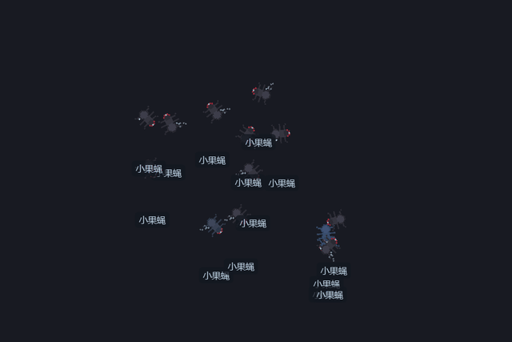

# FlyPet · A desktop fruit-fly swarm that learns

<p align="center">
  
</p>

**FlyPet** is a swarm of fruit flies living on your desktop. Every fly carries a small neural network loosely modeled on the insect **mushroom body**: they forage, socialize, breed, remember dangerous spots, age, and eventually die. All you do is drop some sugar, watch, and occasionally swat the naughty ones — the rest is up to them.

Written in pure Python + PySide6. **Portable, offline, zero install** — just download and run on Windows.

[中文说明](README.md) · [Full manual (Chinese)](MANUAL.md)

---

## Features

- **Learnable brains**: each fly runs a KC→MBON mushroom-body model — rewards and punishments genuinely change behavior (they learn to avoid spots where they got swatted)
- **Genetics & breeding**: well-fed flies lay eggs; offspring inherit genes (appetite / speed / fertility / size) with mutations. Legendary individuals get a breathing golden aura
- **9 skins**: fruit fly / bee / butterfly / dragonfly / firefly / hummingbird / paper plane / rocket / UFO / pixel — custom skin folders supported
- **Desktop toolkit**: pomodoro timer, reminders (the swarm lines up and holds a sign when one fires), clock fly, clipboard history, system monitor, file stashing (drag files onto a fly to auto-organize them)
- **Codex & lineage**: generation number, parents and genes of every fly are recorded
- **Well-behaved resources**: automatic frame down-scaling when dozing, 5 fps while paused, zero handle/memory growth in long-run soak tests (measured, not hoped)

## Quick start

**Option 1: download the exe (recommended)**

Grab `FlyPet.exe` from [Releases](../../releases) and run it — no installer. Right-click the tray icon for the full menu.

**Option 2: run from source**

```bash
pip install PySide6
python pet.py
```

Requires Windows 10+ and Python 3.11+.

**Build your own exe**

```bash
pip install pyinstaller
pyinstaller FlyPet.spec
```

## Test suite (an obsession of this project)

| Tool | Assertions | What it checks |
|---|---|---|
| `_test_paths.py` | 295 | logic assertions, 99% function coverage |
| `_golden.py` | 41 | 12 golden-image baselines compared **byte-for-byte**, with a render-environment fingerprint guard |
| `_mask_check.py` | 21 | the window mask must never clip rendered content |
| `_fps_probe.py` | — | real frame rate per state by counting ticks |
| `_inject_check.py` | 12 cases | reverse injections: re-introduce fixed bugs to prove tests actually go red |
| `_longrun.py` | — | soak test sampling memory / CPU / handles / GDI objects |

```bash
python _test_paths.py
python _golden.py
python _mask_check.py
```

## Custom skins

Create a folder under `skins/` with frames and a `skin.json` (`{"fps":18,"size":56,"facing":"right", ...}`), restart, and it shows up in the tray skin menu. `gen_skin.py` generates multi-frame skins from a single artwork.

## License

[MIT](LICENSE) — use it, hack it, remix it.
